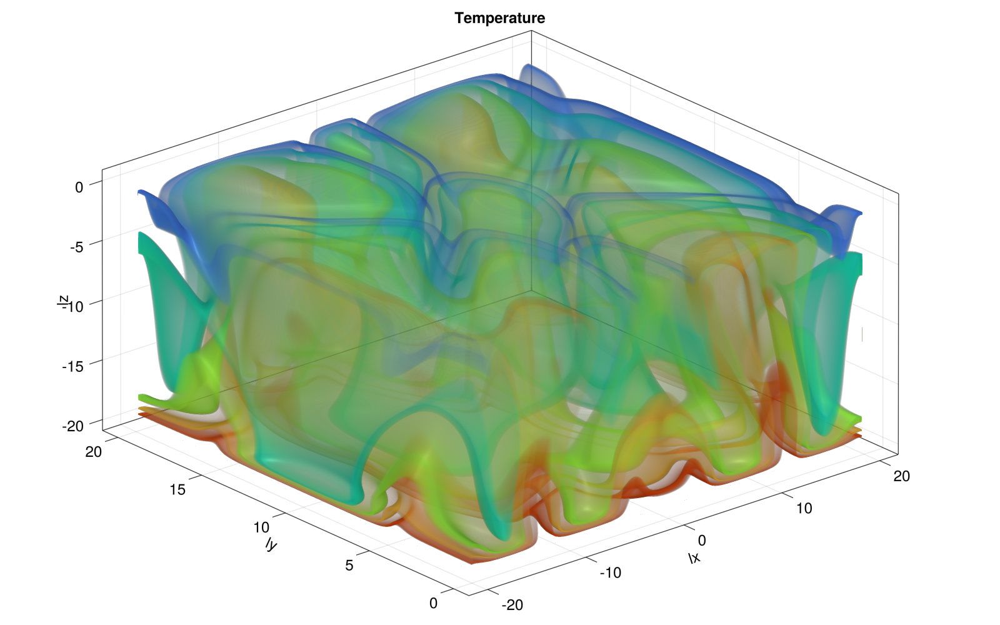
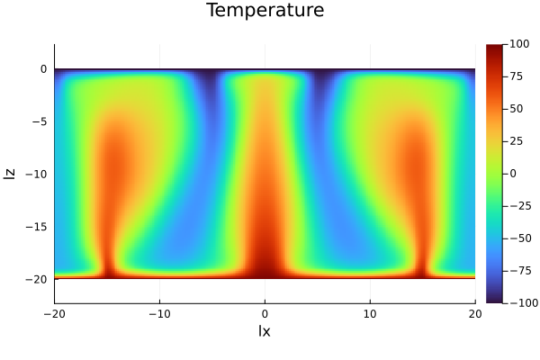

# PorousConvection

## Porous Convection 2D
(Quiver arrows too large however in order to save node-hours simulation was not rerun.)

## Porous Convection 3D

### Final Timestep
#### 3D plot

#### 2D slice

## Porous Convection 3D MPI

