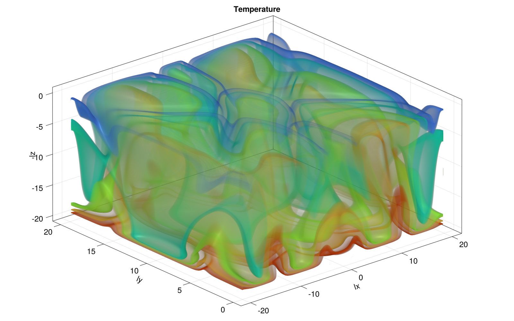
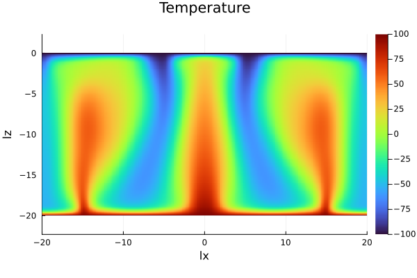
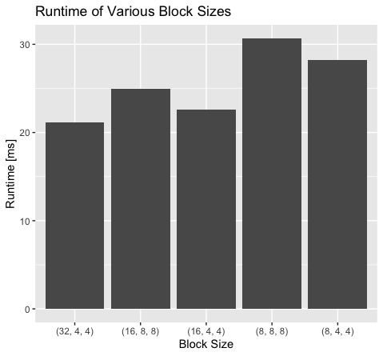
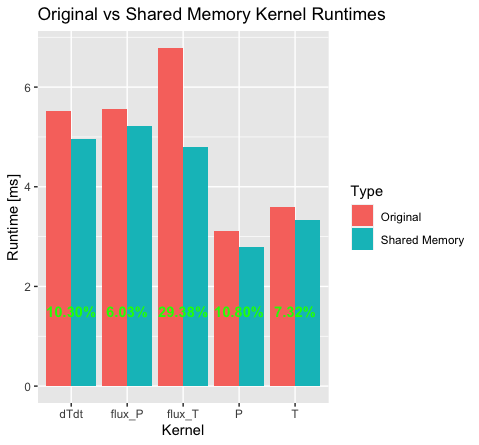
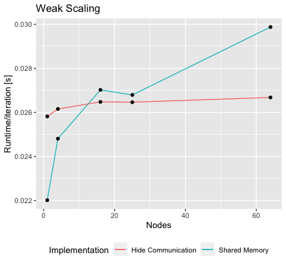

# PorousConvection.jl

[](https://github.com/kszenes/PorousConvection.jl/actions/workflows/CI.yml?query=branch%3Amain)

In this project, we implement a 3D multi-XPU finite-difference solver for the convection of a fluid due to temperature through a porous medium. This process is of particular interest when modeling geophysical events.

The implementation relies on the [ParallelStencil.jl](https://github.com/omlins/ParallelStencil.jl), for the stencil computations, and [ImplicitGlobalGrid.jl](https://github.com/eth-cscs/ImplicitGlobalGrid.jl), for the distributed computation, and achieves good performance due to the explicit use of shared memory to decrease the number of global memory accesses.

**Content**

- [PorousConvection.jl](#porousconvectionjl)
  - [Getting Started](#getting-started)
    - [Installation](#installation)
    - [Code Organisation](#code-organisation)
  - [Theory](#theory)
    - [Equations](#equations)
    - [Numerical Methods](#numerical-methods)
  - [Implementation](#implementation)
  - [Results](#results)
    - [Shared Memory](#shared-memory)
      - [3D plot](#3d-plot)
      - [2D slice](#2d-slice)
    - [Distributed](#distributed)
      - [Porous Convection 3D MPI](#porous-convection-3d-mpi)
    - [Performance](#performance)
      - [Block Size](#block-size)
      - [Speedup](#speedup)
      - [Throughput](#throughput)
      - [Weak Scaling](#weak-scaling)


## Getting Started
### Installation
```
git clone https://github.com/kszenes/PorousConvection.jl
cd PorousConvection.jl
julia --project=.
julia> using Pkg; Pkg.instantiate()
```
### Code Organisation
```
PorousConvection.jl
├── img                  <-- Benchmark plots
├── scripts              <-- Misc scripts
    ├── benchmarks       <-- Scripts to reproduce benchmarks
    ├── plotting         <-- Scripts to produce figures
├── src                  <-- Implementation source
└──test                  <-- Unit and reference tests
```

## Theory
### Equations
The porous convection process was modeled using the following system of equations:

$$
\boldsymbol{q_D} = -\frac{k}{\eta}(\nabla p - \rho_0\alpha\boldsymbol{g}T)
$$

$$
\nabla\cdot\boldsymbol{q_D} = 0
$$

$$
\boldsymbol{q_T} = -\frac{\lambda}{\rho_0 c_p}\nabla T
$$

$$
\frac{\partial T}{\partial t} + \frac{1}{\varphi}\boldsymbol{q_D}\cdot\nabla T + \nabla\cdot\boldsymbol{q_T} = 0
$$

The first equation represents the mass balance using two approximations:
- Darcy's law: assumes a linear dependence between the mass flux and the pressure gradient.
- Boussinesq approximation which models buoyancy by neglecting all contributions of density differences that are not weighted by the gravitational term $g$. This ends up being a good approximation as the terms containing $g$ are dominant.

The 3 other equations respectively represent the incompressibility of the fluid, the heat flux (modeled using Fourier's law) and the energy balance.

### Numerical Methods

To accelerate the solver, we use the pseudo-transient method which adds inertial terms to the Darcy and temperature diffusion fluxes:

$$
\beta\frac{\partial p}{\partial\tau} + \nabla\cdot\boldsymbol{q_D} = 0
$$
$$
\frac{\partial T}{\partial \tau} + \frac{T-T_\mathrm{old}}{\mathrm{d}t} + \frac{1}{\varphi}\boldsymbol{q_D}\cdot\nabla T + \nabla\cdot\boldsymbol{q_T} = 0
$$

These are solved using a conservative finite-differences scheme on a staggered grid. Indeed, the scalars (pressure and temperature) are defined inside the cells while the fluxes are defined on the cell boundaries.

## Implementation

Our implementation consists of essentially 5 kernels for computing the various fields (as well as 2 additional kernels for implementing the boundary conditions). The 5 kernels compute the following fields:
- Pressure kernels:
  - `compute_flux_p_3D!`: Darcy Flux
  - `update_Pf_3D!`: Updates pressure using the Darcy flux
- Temperature kernels:
  - `compute_flux_T_3D!`: Computes the Temperature flux
  - `computedTdt_3D!`: Computes the dTdt term
  - `update_T_3D!`: Updates the temperature using the results of the two previous kernels

To improve the performance of these kernels, we add shared memory for the 3 `compute_*` kernels which reduces the number of global memory accesses. Since stencil computations are inherently memory bound, this optimization can greatly increase the throughput of our implementation.

In ParallelStencil, fine-grained control over shared memory can be achieved using the `@parallel_indices` API, which resembles kernel programming for CUDA, instead of the more terse `@parallel` API. Thus all kernels were first ported to the `@parallel_indices` paradigm.

In each kernel, only a single field is moved into shared memory. As we will be choosing the maximum block size ((32, 4, 4) = 1024) for our architecture, shared memory becomes a scarce resource and storing additional fields in shared memory would decrease significantly the occupancy of the GPU. Thus the `update_*` kernels were not implemented using shared memory.

In addition, auxiliary fields that appear in multiple kernels (such as `gradT*`) are recomputed in each respective kernel to also decrease the number of global memory accesses. In the context of stencil computation, we can afford to make redundant calculations due to the arithmetic intensity being low.


## Results

### Shared Memory
The [PorousConvection_3D.jl](scripts/PorouseConvection_3D.jl) script can be used to perform a shared memory simulation. Note the flag `USE_GPU` which selects the backend to be used. To achieve good performance, ensure that you enabled all optimization flags:

```
julia -O3 --check-bounds=no --project=. scripts/PorousConvection_3D.jl
```
The final result of the simulation is saved in a `.bin` file. It can be visualized using the [plot_3D.jl](scripts/plot_3d.jl) to produce the following result:
#### 3D plot


Alternatively, a 2D slice can be plotted using the [plot_2D_slice.jl](scripts/plot_2d_slice.jl) script:
#### 2D slice


### Distributed
The script [PorousConvection_3D.jl](scripts/PorouseConvection_3D_multixpu.jl) enables the simulation to run distributed using MPI for communication. In case you are running on the SLURM batch system (which manages the MPI library), you can run the script on e.g. 8 processes using the following script:
```
srun -N8 -n8 julia -O3 --check-bounds=no --project=. scripts/PorouseConvection_3D_multixpu.jl
```
The simulation periodically saves the output, as `.bin` files, to a directory (named `viz3Dmpi_out` by default). The visualization script [plot_3D_animation.jl](scripts/plot_3d_animation.jl) can be used to produce an animation:
#### Porous Convection 3D MPI


### Performance

The benchmarks were performed on Piz Daint supercomputer which has a single NVIDIA® Tesla® P100 GPU with 16GB of memory per node.

#### Block Size
The performance characteristic of GPU kernels is highly dependent on the correct selection of the block size. In the following benchmark, we evaluate the total runtime of the 5 stencil kernels for varying block sizes. This benchmark can be reproduced using [this](scripts/benchmarks/benchmark_block_size.jl) script.

Thus we select the (32, 4, 4) block size for all subsequent numerical experiments as this exhibited the best performance.



#### Speedup
In this section, we evaluate the speedup achieved in our improved implementation using shared memory. The following benchmark compares the runtime for each kernel of the 5 kernels between the original and shared memory implementation. The percentage in each bar plot signifies the percentage of speedup. This benchmark may be reproduced using [this](scripts/benchmarks/benchmark_shmem.jl) script.




As illustrated by the plot, we obtain good speedups for each kernel averaging a **14.2%** overall speedup. Surprisingly, we also observe speedups for the kernels updating the pressure and temperature, which do not use shared memory. However, these two stencils have been ported to the `@parallel_indices` implementation which enables us to manually select the block size. This is most likely the reason for the performance increase.


#### Throughput
In this section, we discuss the achieved effective memory throughput for the 5 stencils. The results are illustrated in the plot below. Note that the empirical maximum throughput on the NVIDIA P100 is ~550 [GB/s].


This plot suggests that the two stencils which were not implemented using shared memory (`P` and `T`) exhibit the best effective throughput. However, we would expect these kernels to be precisely the least efficient. An explanation for this could be that since these kernels are the simplest expression containing few repeated fields (each field is used only in one expression) and thus they suffer less from redundant global memory accesses. This makes them particularly performant even using the naive `@parallel` implementation.

#### Weak Scaling
All previous benchmarks were conducted on a single GPU. In this section, we will evaluate the scaling of our distributed implementation. 

ParallelStencil comes with a feature for overlapping computation and communication called `@hide_communication`. Unfortunately, this feature does not seem to support the low-level `@parallel_indices` API which prevents its use with our shared memory implementation.

In the figure below, we can see the weak scaling for two implementations. One that includes shared memory (and thus does not overlap communication) and one which overlaps communication (and thus does not use shared memory). 



We observe that for single-node computations (where there is no communication), the shared memory implementation performs better. However, as we increase the number of nodes the communication becomes the bottleneck and the efficiency gained by overlapping the computation and communication outweighs the performance benefit of shared memory.
