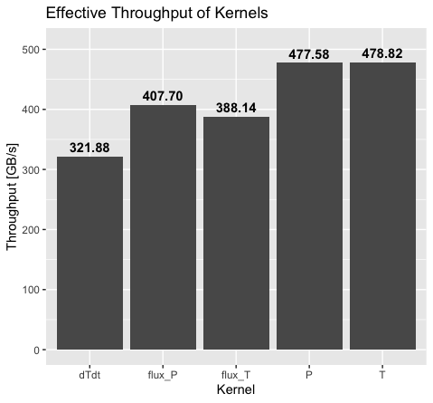

# PorousConvection.jl
- Shared memory (used CUDA primitives)
- Removed superfluous fields (gradT*) and dTdt
  - Fused kernels for since dTdt removed

## Theory

### Introduction
In this project, we implement a 3D multi-XPU solver for the convection of a fluid due to temperature through a porous media. This is a procees that is of particular interest when modelling geophysics.

### Equations
The porous convection process was modelled using the following system of equations:

$$
\boldsymbol{q_D} = -\frac{k}{\eta}(\nabla p - \rho_0\alpha\boldsymbol{g}T)
$$
$$
\nabla\cdot\boldsymbol{q_D} = 0
$$
$$
\boldsymbol{q_T} = -\frac{\lambda}{\rho_0 c_p}\nabla T
$$
$$
\frac{\partial T}{\partial t} + \frac{1}{\varphi}\boldsymbol{q_D}\cdot\nabla T + \nabla\cdot\boldsymbol{q_T} = 0
$$

The first equation represents the mass balance using two approximations:
- Darcy's law: assumes a linear dependence between the mass flux and the pressure gradient.
- Boussinesq approximation which models buoyancy by neglecting all contributions of density differences which are not weighted by the gravitational term $g$. This ends up being a good approximation as the terms containing $g$ are dominant.

?The second equation represents the incompressibility of the fluid
The third equation models the heat flux using Fourier's law.
The last equation represents the energy equation.

### Numerical Methods

To accelerate the solver, we use the pseudo-transient method which adds inertial terms to the Darcy and temperature diffusion fluxes:

$$
\beta\frac{\partial p}{\partial\tau} + \nabla\cdot\boldsymbol{q_D} = 0
$$
$$
\frac{\partial T}{\partial \tau} + \frac{T-T_\mathrm{old}}{\mathrm{d}t} + \frac{1}{\varphi}\boldsymbol{q_D}\cdot\nabla T + \nabla\cdot\boldsymbol{q_T} = 0
$$

These are solved using a conservative finite-differences scheme on a staggered grid. Indeed, the scalars (pressure and temperature) are defined inside the cells while the fluxes are defined on the cell boundaries.

### Implementation
- Parallel Stencil
- Optimizations
  - Kernel fusion 
    - Eliminating auxiliary fields
  - Shared Memory

## Results

The benchmarks were performed on Piz Daint with the CPU code executed on two 18-core Intel® Xeon® E5-2695 v4 @ 2.10GHz and the GPU code on a NVIDIA® Tesla® P100 with 16GB of memory.

